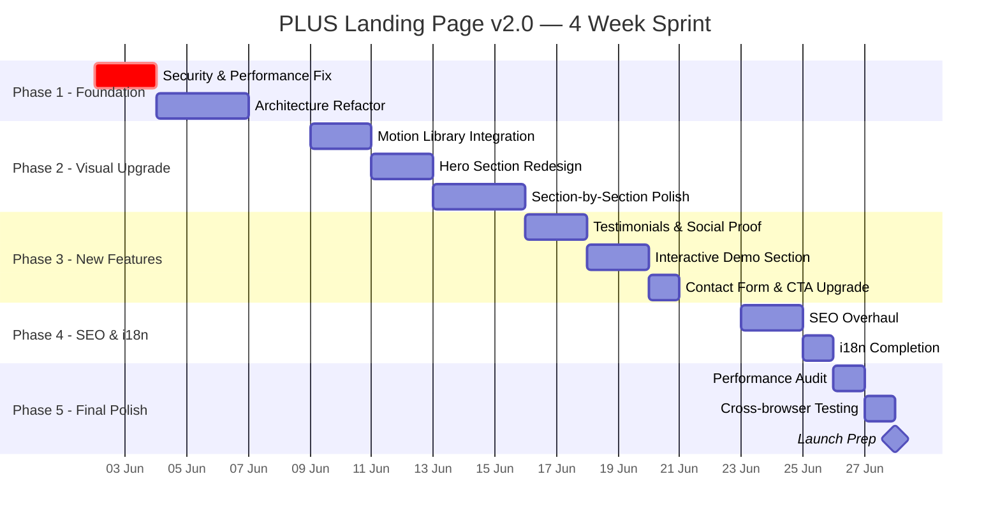

# 🔍 PLUS Landing Page — Full Audit & v2.0 Upgrade Plan

> **Auditor:** Antigravity AI | **Date:** 29 Mei 2026  
> **Project:** PLUS — Indonesia's No.1 Digital AI-gency  
> **Domain:** plusthe.site | **Stack:** Next.js 16 + Tailwind v4 + Supabase + Gemini AI  
> **Current Version:** v1.0.0 (Februari 2026)

---

## 📊 Executive Summary — Current State Scorecard

| Dimensi | Skor | Grade | Catatan Utama |
|---------|------|-------|---------------|
| 🎨 Visual Design | 7.0/10 | **B** | Solid design system, tapi terlalu konservatif & kurang "wow factor" |
| ✨ Animasi & Motion | 5.5/10 | **C+** | CSS-only, repetitif fade-up di semua section |
| 📱 Responsif | 7.5/10 | **B+** | Mobile-first bagus, tapi belum ada tablet-specific breakpoints |
| ⚡ Performance | 5.0/10 | **C** | Image optimization dimatikan, API key bocor ke client |
| 🔎 SEO | 4.5/10 | **C-** | Metadata dasar ada, tapi sitemap incomplete, no JSON-LD |
| 🏗️ Arsitektur | 6.0/10 | **B-** | Clean separation, tapi duplikasi masif di product pages |
| ♿ Aksesibilitas | 4.0/10 | **D+** | Minimal ARIA, no skip links, no focus management |
| 🧹 Code Quality | 6.5/10 | **B-** | TypeScript dipakai tapi banyak `any`, konsistensi kurang |

**Overall Score: 5.75/10 — Butuh upgrade signifikan sebelum public launch.**

---

## 🔴 TEMUAN KRITIS (Harus Diperbaiki Segera)

### 1. API Key Exposure — SECURITY RISK
```
File: src/lib/ai.ts
Issue: NEXT_PUBLIC_GEMINI_API_KEY exposed ke browser client
```
Gemini API key di-prefix `NEXT_PUBLIC_` sehingga terekspos ke client-side JavaScript. Siapapun bisa mengekstrak key ini dari browser DevTools → Network tab. **Ini bisa menyebabkan billing abuse.**

> [!CAUTION]
> Semua AI calls HARUS dipindah ke API routes (server-side). Hapus prefix `NEXT_PUBLIC_` dari Gemini API key.

### 2. Image Optimization Dimatikan Total
```
Semua <Image> component: unoptimized={true}
```
Setiap penggunaan `next/image` memiliki prop `unoptimized`, sepenuhnya mematikan image optimization yang merupakan fitur inti Next.js. Ini berarti:
- Tidak ada WebP/AVIF conversion
- Tidak ada responsive srcset
- Tidak ada lazy loading optimization
- Bandwidth boros, LCP (Largest Contentful Paint) buruk

### 3. Theme Flash Prevention Script Hilang
```tsx
// layout.tsx line 49-52
<head>
  {/* Prevent flash of wrong theme */}
</head>
```
Ada komentar yang menyebutkan prevention script, tapi **scriptnya sendiri tidak ada**. User akan melihat flash putih sebelum dark mode ter-apply.

### 4. BUG HARGA PRICING — Annual LEBIH MAHAL dari Monthly!
```typescript
// Pricing.tsx
const monthlyPrices = ["$25", "$50", "$500"];  // ← lebih murah
const annualPrices = ["$30", "$65", "$650"];   // ← LEBIH MAHAL?!
```
Ini jelas **terbalik**. Annual seharusnya lebih murah sebagai insentif berlangganan tahunan. Customer yang melihat ini akan bingung atau kehilangan trust.

> [!CAUTION]
> Fix ini harus dilakukan SEGERA. Harga annual harus LEBIH MURAH dari monthly.

---

## 🟡 TEMUAN MAJOR (Harus Diperbaiki Sebelum Launch)

### 4. Duplikasi Kode Masif — 7 Product Pages
7 halaman produk (AI Image, AI Music, AI Text, AI Video, CRM, Customer Support, Mobile App) berbagi **95%+ kode identik**. Hanya berbeda di: ikon, color scheme, avatar URL, dan translation key. Ini harus di-refactor menjadi satu komponen `ProductPageTemplate`.

### 5. i18n Tidak Konsisten
- `digital-agency/page.tsx` and `mobile-game/page.tsx` memiliki **semua teks hardcoded English** — tidak menggunakan translation keys
- `useTranslation()` return type `any` (eslint-disable di setiap file) — kehilangan type safety
- Translation quality issue: "< 30d" seharusnya "< 30s" (detik, bukan hari) di locale ID

### 6. Hardcoded Hex Colors vs Design System
Pattern seperti `text-[#0F172A] dark:text-[#F8FAFC]` digunakan di mana-mana, padahal sudah ada `text-foreground` di design system. Ini membuat maintenance sulit dan tema tidak konsisten.

### 7. SEO Incomplete
- **Sitemap** hanya list 4 dari 12+ halaman
- **Tidak ada JSON-LD** structured data
- **Tidak ada hreflang** tags untuk EN/ID
- **Tidak ada OG image**
- **Tidak ada Twitter card** metadata
- **Tidak ada canonical URLs**
- 7 product pages TIDAK bisa export metadata (client components)

### 8. External Resource Dependency
- Background noise texture dari `https://grainy-gradients.vercel.app/noise.svg` — harus self-hosted
- Semua gambar dari Unsplash tanpa optimization

### 9. Navbar — Missing href="#contact" Target
Di homepage, CTA button di navbar mengarah ke `#contact`, tapi tidak ada section dengan `id="contact"`. Footer memiliki `id="contact"`, tapi ini tidak intuitif.

### 10. Strings Tidak Ditranslate
Beberapa teks masih hardcoded English dan tidak melewati sistem i18n:
- **Navbar dropdown**: Product labels (`p.labelKey`) menampilkan "AI Chat Bot", "Customer Support" dll langsung, bukan dari translation
- **Footer**: Product link labels (`link.labelKey`) juga hardcoded English
- **Features**: Badge "Popular" dan "New" tidak ditranslate
- **Pricing**: Teks "/month" hardcoded English
- **Footer**: Cross-references `t.pricing.badge` dan `t.navbar.aiFeatures` — fragile pattern

### 11. Social Links Missing `target="_blank"`
Social media links di Footer (Instagram, Facebook, X, LinkedIn) akan **navigasi user keluar** dari website karena tidak ada `target="_blank"` dan `rel="noopener noreferrer"`.

### 12. HTML `lang` Tidak Update saat Switch Language
Ketika user switch dari EN ke ID, attribute `<html lang="en">` **tetap "en"** — ini menyebabkan screen readers membaca text Indonesia dengan pronunciation English.

### 13. Hydration Mismatch Risk
`LanguageProvider` membaca `localStorage` di `useState` initializer. Jika server renders "en" tapi client punya "id" tersimpan, terjadi **hydration mismatch** (flash konten English sebelum switch ke Indonesian).

---

## 🟢 TEMUAN MINOR

| # | Issue | File | Detail |
|---|-------|------|--------|
| 10 | Typo "Brigther" | globals.css:109 | Seharusnya "Brighter" |
| 11 | Empty `/api/debug/` | api/debug/ | Dead code directory |
| 12 | Naming mismatch | page.tsx:4 | `Products` diimport dari `Features.tsx` |
| 13 | Duplicate `@theme` blocks | globals.css:197,674 | Dua deklarasi bisa conflict |
| 14 | Body transition 0.4s | globals.css:254 | Bisa jank di low-end devices |
| 15 | README boilerplate | README.md | Masih default Next.js, mention Vercel (padahal deploy ke Netlify) |
| 16 | No Netlify plugin | netlify.toml | Missing `@netlify/plugin-nextjs` untuk SSR |
| 17 | Studio translations missing | translations.ts | Dashboard UI strings tidak di-translate |

---

## 🎯 HAL-HAL POSITIF (Yang Harus Dipertahankan)

> [!TIP]
> Ini adalah fondasi yang kuat untuk v2.0

1. ✅ **Design system yang terstruktur** — CSS variables dengan light/dark theme lengkap
2. ✅ **i18n coverage luas** — 19 sections x 2 bahasa dengan paritas penuh
3. ✅ **Tailwind v4 integration** — `@theme inline` mapping yang proper
4. ✅ **Component separation bersih** — setiap section punya file sendiri
5. ✅ **Database schema solid** — 4 tabel dengan RLS policies yang benar
6. ✅ **Scroll reveal hook** — IntersectionObserver yang efisien (unobserve after trigger)
7. ✅ **Dark mode implementation** — Comprehensive color overrides
8. ✅ **Language toggle UI** — Sliding pill design yang elegan

---

## 🚀 PLUS LANDING PAGE v2.0 — UPGRADE PLAN

### 🎯 Visi v2.0
> Transformasi dari landing page yang "bagus" menjadi **world-class showcase** yang membuat pengunjung berkata "WOW" dalam 3 detik pertama. Landing page harus bisa **carry** — menjual tanpa perlu sales pitch.

---

### 📅 Timeline & Fase



---

### 🔧 PHASE 1: Foundation & Critical Fixes (3-5 hari)

#### 1.1 Security Fix — API Key Migration
```diff
- // src/lib/ai.ts — CLIENT SIDE (BERBAHAYA)
- const API_KEY = process.env.NEXT_PUBLIC_GEMINI_API_KEY;
+ // src/app/api/ai/route.ts — SERVER SIDE (AMAN)  
+ const API_KEY = process.env.GEMINI_API_KEY; // tanpa NEXT_PUBLIC_
```

**Tasks:**
- [ ] Buat `/api/ai/generate` route handler (server-side)
- [ ] Pindahkan semua Gemini calls ke API routes
- [ ] Hapus `NEXT_PUBLIC_GEMINI_API_KEY` dari `.env`
- [ ] Update client code untuk call API route, bukan langsung ke Gemini

#### 1.2 Image Optimization
**Tasks:**
- [ ] Hapus `unoptimized` prop dari SEMUA `<Image>` components
- [ ] Self-host gambar kritis (hero, about) — download dari Unsplash ke `/public/images/`
- [ ] Konfigurasi `next.config.ts` remote patterns yang proper
- [ ] Implementasi blur placeholder dengan `plaiceholder` library
- [ ] Ganti noise texture SVG ke self-hosted

#### 1.3 Architecture Refactor — Product Page Template
```
SEBELUM (7 files, ~95% identical):
├── ai-image-generator/page.tsx (300 lines)
├── ai-music-generator/page.tsx (300 lines)  
├── ai-text-generator/page.tsx (300 lines)
├── ai-video-generator/page.tsx (300 lines)
├── crm/page.tsx (300 lines)
├── customer-support/page.tsx (300 lines)
└── mobile-app/page.tsx (300 lines)

SESUDAH (1 template + 7 config files):
├── components/ProductPageTemplate.tsx (300 lines)
├── ai-image-generator/page.tsx (30 lines — config only)
├── ai-music-generator/page.tsx (30 lines)
└── ... (each just passes props to template)
```

**Tasks:**
- [ ] Buat `ProductPageTemplate.tsx` dengan props yang configurable
- [ ] Refactor setiap product page menjadi konfigurasi ringan
- [ ] Pisahkan metadata ke `layout.tsx` untuk setiap route (SEO fix)
- [ ] Konversi product pages ke Server Components dimana memungkinkan

#### 1.4 Type-Safe i18n
```typescript
// SEBELUM
export function useTranslation(): any { ... }

// SESUDAH  
type TranslationKeys = typeof translations['en'];
export function useTranslation(): TranslationKeys { ... }
```

**Tasks:**
- [ ] Hapus semua `eslint-disable @typescript-eslint/no-explicit-any`
- [ ] Buat proper TypeScript types untuk translation object
- [ ] Fix digital-agency & mobile-game i18n (hardcoded → translation keys)
- [ ] Fix translation typos (< 30d → < 30s di locale ID)

#### 1.5 Theme Flash Prevention
```tsx
// Tambahkan ke layout.tsx <head>
<script dangerouslySetInnerHTML={{ __html: `
  (function() {
    try {
      var theme = localStorage.getItem('theme');
      if (theme === 'dark' || (!theme && window.matchMedia('(prefers-color-scheme: dark)').matches)) {
        document.documentElement.classList.add('dark');
      }
    } catch(e) {}
  })();
`}} />
```

---

### 🎨 PHASE 2: Visual & Motion Upgrade (5-7 hari)

> [!IMPORTANT]
> Ini adalah fase yang akan membuat perbedaan TERBESAR antara v1 and v2. Landing page harus terasa "alive" dan "premium."

#### 2.1 Library Baru yang Direkomendasikan

| Library | Purpose | Why |
|---------|---------|-----|
| **Framer Motion** | Animasi & page transitions | Industry standard, React-native, GPU-accelerated |
| **Lenis** | Smooth scrolling | Ultra-smooth scroll experience, lightweight |
| **@react-three/fiber** + **drei** | 3D elements (optional) | Hero section 3D background |
| **Embla Carousel** | Testimonials slider | Lightweight, accessible, touch-friendly |
| **react-countup** | Animated numbers | Stats section counter animation |
| **react-intersection-observer** | Scroll triggers | Better DX than custom hook |

```bash
npm install framer-motion lenis embla-carousel-react react-countup react-intersection-observer
```

#### 2.2 Hero Section — Complete Redesign

**Current Problems:**
- Static Unsplash background — generic, tidak unik
- Text-only content — tidak ada visual interest
- Animasi hanya fade-up — predictable
- Floating circles terlalu subtle — hampir tidak terlihat

**v2.0 Hero Proposal:**

```
┌─────────────────────────────────────────────────────┐
│  ┌──────┐                    [Theme] [Lang] [CTA]   │
│  │ plus.│   About  Products  AI  Pricing            │
│  └──────┘                                           │
│                                                     │
│        ✦ AI-Powered Marketing Studio                │
│                                                     │
│     Build Smarter Brands.                           │
│          Faster.                                    │
│                                                     │
│     One integrated platform untuk brands            │
│     yang pengen move fast & look premium.           │
│                                                     │
│     [🚀 Explore Products]   [💰 View Pricing]      │
│                                                     │
│  ┌─────────────────────────────────────────────┐    │
│  │  ░░░░ INTERACTIVE 3D/ANIMATED ELEMENT ░░░░  │    │
│  │  ░░░ (Floating UI cards / Brand mockup) ░░░ │    │
│  └─────────────────────────────────────────────┘    │
│                                                     │
│  Trusted by 50+ brands   │  100+ Projects  │  24/7 │
│                                                     │
│  ── Scroll indicator animation ──                   │
└─────────────────────────────────────────────────────┘
```

**Key Changes:**
- [ ] **Animated gradient mesh background** — bukan foto stock (pakai CSS `@property` + hue-rotate)
- [ ] **Typing effect** untuk tagline — "Build Smarter Brands. Faster." typed one by one
- [ ] **Floating UI mockup cards** yang orbit di sekitar hero — menunjukkan dashboard/product preview
- [ ] **Particle effect** atau animated grid di background
- [ ] **Scroll indicator** di bottom — animated bouncing arrow
- [ ] **Trusted by brands logo bar** — animated marquee/infinite scroll
- [ ] **Number counter** untuk stats — countUp dari 0 ke value saat masuk viewport

#### 2.3 Section-by-Section Motion Upgrade

**About Section:**
- [ ] Replace static images → parallax scrolling images
- [ ] Stats angka → countUp animation dengan easing
- [ ] Badge "Driven by Innovation" → shimmer animation
- [ ] Stagger animation untuk setiap stat item

**Products/Features Section:**
- [ ] Card hover → 3D tilt effect (CSS perspective transform)
- [ ] Grid masuk → staggered reveal (bukan semua sekaligus)
- [ ] Icon → animated icon (Lottie atau CSS animation)
- [ ] Badge "Popular"/"New" → pulse glow animation
- [ ] Add preview image/screenshot per product card

**AI Features Section:**
- [ ] Tambahkan animated gradient border pada card hover
- [ ] Icon scaling → bounce animation
- [ ] Add connection lines antar AI features (SVG path animation)
- [ ] Section background → animated dot matrix pattern

**Pricing Section:**
- [ ] Price toggle → animated morph transition antara monthly ↔ annual
- [ ] Highlighted card → floating/elevated effect lebih dramatis
- [ ] Price angka → countUp animation saat switching
- [ ] "Recommended" badge → gradient shimmer loop
- [ ] Add comparison table toggle option

**FAQ Section:**
- [ ] Accordion → smooth spring animation (Framer Motion)
- [ ] Add decorative illustration/icon per FAQ item
- [ ] Active item → left border accent animation
- [ ] Add search/filter functionality

**Footer:**
- [ ] Add newsletter signup form
- [ ] Social links → icon buttons dengan hover color branding
- [ ] "Back to top" → smooth scroll dengan progress indicator
- [ ] Add mini sitemap/recent posts section

#### 2.4 Global Motion System

```css
/* Replace custom CSS animations with Framer Motion variants */
const fadeInUp = {
  hidden: { opacity: 0, y: 40 },
  visible: { 
    opacity: 1, 
    y: 0,
    transition: { duration: 0.6, ease: [0.25, 0.46, 0.45, 0.94] }
  }
};

const staggerContainer = {
  visible: {
    transition: { staggerChildren: 0.1, delayChildren: 0.2 }
  }
};
```

- [ ] Implementasi page transition animations (exit + enter)
- [ ] Smooth scroll dengan Lenis
- [ ] Scroll-linked progress bar di navbar
- [ ] Parallax effects pada background elements
- [ ] Cursor glow/follower effect (subtle, optional)

---

## ✨ PHASE 3: New Sections & Features (3-5 hari)

#### 3.1 Testimonials / Social Proof Section (NEW)
Landing page saat ini **tidak memiliki social proof sama sekali**. Ini adalah gap KRITIS untuk konversi.

```
┌─────────────────────────────────────────────────┐
│  ⭐ What Our Clients Say                        │
│                                                 │
│  ┌────────┐  ┌────────┐  ┌────────┐            │
│  │ Avatar │  │ Avatar │  │ Avatar │  ← Carousel │
│  │ "Plus  │  │ "Game  │  │ "Their │            │
│  │  helped│  │  chang │  │  AI    │            │
│  │  our..." │  │  er"  │  │  tools"│            │
│  │ ★★★★★  │  │ ★★★★★  │  │ ★★★★☆  │            │
│  │ CEO,   │  │ CMO,   │  │ CTO,   │            │
│  │ Brand X│  │ Brand Y│  │ Brand Z│            │
│  └────────┘  └────────┘  └────────┘            │
│                                                 │
│  [●] [ ] [ ]  ← dot navigation                 │
└─────────────────────────────────────────────────┘
```

**Tasks:**
- [ ] Buat `Testimonials.tsx` component dengan Embla Carousel
- [ ] Design testimonial card dengan avatar, quote, rating, company
- [ ] Auto-play carousel dengan python code/script or custom autoplay
- [ ] Add to translations (EN + ID)
- [ ] Responsive: 1 card mobile, 2 tablet, 3 desktop

#### 3.2 Clients/Partners Logo Bar (NEW)
```
Trusted by Indonesia's leading brands
[Logo1] [Logo2] [Logo3] [Logo4] [Logo5] ← infinite scroll marquee
```

- [ ] Animated infinite scroll marquee (CSS-only atau Framer Motion)
- [ ] Grayscale logos → color on hover
- [ ] Responsive speed adjustment

#### 3.3 Interactive Demo Section (NEW)
Tambahkan section yang memungkinkan visitor **mencoba** produk secara live:
- [ ] Chat bot widget preview (iframe atau embedded)
- [ ] AI image generation demo (1 free try)
- [ ] Before/after slider untuk hasil campaign

#### 3.4 Contact Form Integration
Saat ini CTA "Contact Us" mengarah ke external link. v2.0 harus punya **inline contact form**:
- [ ] Form dengan fields: Name, Email, Company, Message
- [ ] Submit ke `/api/contact` (sudah ada)
- [ ] Success animation (confetti atau checkmark)
- [ ] Form validation dengan error states yang jelas

#### 3.5 CTA Section — Before Footer (NEW)
```
┌─────────────────────────────────────────────────┐
│  ┌─ gradient background ──────────────────────┐ │
│  │                                             │ │
│  │  Ready to Transform Your Brand?             │ │
│  │  Join 50+ companies using PLUS              │ │
│  │                                             │ │
│  │  [🚀 Start Free Trial]  [📞 Book a Demo]   │ │
│  │                                             │ │
│  └─────────────────────────────────────────────┘ │
└─────────────────────────────────────────────────┘
```

---

## 🔎 PHASE 4: SEO & i18n Overhaul (2-3 hari)

#### 4.1 Dynamic Sitemap
```typescript
// src/app/sitemap.ts
export default function sitemap(): MetadataRoute.Sitemap {
  const routes = ['/', '/chat-bot', '/customer-support', '/mobile-app', 
    '/crm', '/digital-agency', '/mobile-game',
    '/ai-image-generator', '/ai-text-generator', 
    '/ai-video-generator', '/ai-music-generator'];
  
  return routes.map(route => ({
    url: `https://plusthe.site${route}`,
    lastModified: new Date(),
    changeFrequency: route === '/' ? 'weekly' : 'monthly',
    priority: route === '/' ? 1 : 0.8,
    alternates: {
      languages: { en: `https://plusthe.site/en${route}`, id: `https://plusthe.site/id${route}` }
    }
  }));
}
```

#### 4.2 Structured Data (JSON-LD)
- [ ] Organization schema di root layout
- [ ] Product schema per product page
- [ ] FAQ schema di FAQ section (rich snippets!)
- [ ] BreadcrumbList schema

#### 4.3 Complete Metadata per Route
- [ ] Setiap route harus punya `layout.tsx` dengan metadata export
- [ ] OG images — generate dengan `next/og` (ImageResponse API)
- [ ] Twitter card metadata
- [ ] Canonical URLs
- [ ] Hreflang tags untuk EN/ID

#### 4.4 i18n Routing (Optional — Major Enhancement)
```
https://plusthe.site/en/        → English
https://plusthe.site/id/        → Indonesian
https://plusthe.site/           → Auto-detect atau default EN
```

- [ ] Implement middleware-based i18n routing
- [ ] Move language detection ke URL path
- [ ] Update sitemap dengan alternates

---

## 🏁 PHASE 5: Final Polish & Launch (2-3 hari)

#### 5.1 Performance Audit
- [ ] Run Lighthouse audit — target 90+ semua kategori
- [ ] Implement `<link rel="preload">` untuk critical assets
- [ ] Code splitting per route (`next/dynamic`)
- [ ] Optimize CSS — remove unused styles
- [ ] Add `loading="lazy"` ke below-fold images
- [ ] Implement Vercel Analytics atau Web Vitals monitoring

#### 5.2 Cross-Browser Testing
- [ ] Chrome, Firefox, Safari, Edge
- [ ] iOS Safari, Android Chrome
- [ ] Dark mode di semua browser
- [ ] RTL support evaluation (future-proof)

#### 5.3 Accessibility Audit
- [ ] Add skip navigation link
- [ ] Keyboard navigation testing
- [ ] Screen reader testing
- [ ] Color contrast verification (WCAG AA)
- [ ] Focus indicators yang visible
- [ ] ARIA labels yang proper
- [ ] `prefers-reduced-motion` media query support

#### 5.4 Final Checklist
- [ ] Update README.md — proper project documentation
- [ ] Update robots.txt — verify all routes
- [ ] Netlify config — add `@netlify/plugin-nextjs`
- [ ] Environment variables — verify production values
- [ ] Error handling — custom 404 & 500 pages
- [ ] Analytics setup — GA4 atau Plausible
- [ ] Cookie consent banner (jika diperlukan)

---

## 📐 Arsitektur v2.0 — Proposed Structure

```
src/
├── app/
│   ├── layout.tsx                    # Root layout (Server Component)
│   ├── page.tsx                      # Homepage (Server Component)
│   ├── sitemap.ts                    # Dynamic sitemap [NEW]
│   ├── robots.ts                     # Dynamic robots.txt [NEW]
│   ├── not-found.tsx                 # Custom 404 [NEW]
│   ├── error.tsx                     # Custom error page [NEW]
│   ├── (products)/                   # Route group for product pages
│   │   ├── layout.tsx                # Shared product layout + metadata
│   │   ├── chat-bot/page.tsx
│   │   ├── crm/page.tsx
│   │   └── ...
│   └── api/
│       ├── ai/route.ts              # Server-side AI proxy [NEW]
│       ├── contact/route.ts
│       ├── chat/route.ts
│       └── health/route.ts
├── components/
│   ├── sections/                     # Landing page sections [REORGANIZE]
│   │   ├── Hero.tsx
│   │   ├── About.tsx
│   │   ├── Products.tsx
│   │   ├── AIFeatures.tsx
│   │   ├── Testimonials.tsx          # [NEW]
│   │   ├── ClientLogos.tsx           # [NEW]
│   │   ├── Pricing.tsx
│   │   ├── FAQ.tsx
│   │   ├── CTABanner.tsx             # [NEW]
│   │   └── ContactForm.tsx           # [NEW]
│   ├── layout/                       # Layout components [REORGANIZE]
│   │   ├── Navbar.tsx
│   │   ├── Footer.tsx
│   │   └── ScrollProgress.tsx        # [NEW]
│   ├── shared/                       # Shared/reusable [NEW]
│   │   ├── ProductPageTemplate.tsx   # [NEW] — replaces 7 duplicate pages
│   │   ├── AnimatedCounter.tsx       # [NEW]
│   │   ├── GradientText.tsx          # [NEW]
│   │   └── SectionHeader.tsx         # [NEW]
│   ├── ui/                           # Primitive UI components [NEW]
│   │   ├── Button.tsx
│   │   ├── Card.tsx
│   │   ├── Badge.tsx
│   │   └── Input.tsx
│   └── providers/
│       ├── ThemeProvider.tsx
│       ├── LanguageProvider.tsx
│       └── SmoothScrollProvider.tsx   # [NEW] — Lenis wrapper
├── lib/
│   ├── translations.ts               # i18n strings (typed)
│   ├── supabase.ts
│   ├── animations.ts                 # [NEW] — Framer Motion variants
│   ├── metadata.ts                   # [NEW] — Shared metadata helpers
│   └── constants.ts                  # [NEW] — Shared constants
├── hooks/
│   ├── useScrollReveal.ts            # [UPGRADE] → use react-intersection-observer
│   ├── useMediaQuery.ts              # [NEW]
│   └── useReducedMotion.ts           # [NEW]
└── types/
    ├── index.ts                      # App types
    ├── database.ts                   # Supabase types
    └── translations.ts               # [NEW] — i18n type definitions
```

---

## 🎯 EVALUASI: Apakah v2.0 Ini Cukup untuk "Carry"?

### Yang Membuat Landing Page "Carry" (Menjual Sendiri):

| Element | v1.0 | v2.0 Plan | Impact |
|---------|------|-----------|--------|
| First Impression (0-3 detik) | Generic hero | Animated gradient + floating UI | ⬆️⬆️⬆️ |
| Social Proof | ❌ Tidak ada | Testimonials + Client logos | ⬆️⬆️⬆️ |
| Interactive Demo | ❌ Tidak ada | Live chatbot + AI demo | ⬆️⬆️ |
| Motion & Animation | Repetitif fade-up | Varied, purposeful, delightful | ⬆️⬆️ |
| Performance (LCP) | ~3-5s (unoptimized images) | <2s target | ⬆️⬆️ |
| SEO/Discoverability | Incomplete | Full structured data + sitemap | ⬆️⬆️ |
| Trust Signals | Minimal stats | Numbers + logos + testimonials | ⬆️⬆️⬆️ |
| CTA Clarity | Scattered | Clear funnel: Explore → Try → Contact | ⬆️⬆️ |
| Mobile Experience | Basic responsive | Polished with gestures | ⬆️ |

---

## 🤖 ULTIMATE VIBE CODING PROMPT

> [!IMPORTANT]  
> Prompt ini dirancang untuk digunakan di awal conversation baru saat memulai pengembangan v2.0. Copy-paste prompt ini ke AI coding assistant untuk mendapatkan hasil yang konsisten dan berkualitas tinggi.

```markdown
# 🚀 PLUS Landing Page v2.0 — Vibe Coding Master Prompt

You are building version 2.0 of the PLUS landing page — Indonesia's #1 Digital AI-gency (plusthe.site). 

## CONTEXT
- **Stack:** Next.js 16 (App Router) + Tailwind CSS v4 + TypeScript + Supabase + Framer Motion + Lenis
- **Existing codebase** at `e:\PLUSSSSS\plusthesite-\` — read ALL files before making changes
- **Design system** already exists in `globals.css` with CSS variables for colors, shadows, and surfaces
- **i18n** already implemented with EN/ID translations in `src/lib/translations.ts`
- **Current sections:** Navbar → Hero → About → Products → AIFeatures → Pricing → FAQ → Footer

## YOUR DESIGN PERSONALITY
You are a **world-class UI engineer** with the aesthetic taste of a top Dribbble/Awwwards designer. You believe that:
- Every pixel matters. Spacing, alignment, typography — perfectionism is non-negotiable.
- Motion design is storytelling. Every animation has purpose: to guide attention, reveal hierarchy, or delight the user.
- Dark mode is the premium experience. Neon glows, glassmorphism, and subtle gradients are your signature.
- Performance is design. A beautiful page that loads slowly is not beautiful.

## KEY DESIGN PRINCIPLES
1. **Gradient Mesh Backgrounds** — No stock photos for hero. Use animated CSS gradients with `@property` for smooth hue rotation.
2. **Staggered Reveals** — Use Framer Motion's `staggerChildren` for cards, lists, and grid items. Never animate everything at once.
3. **3D Card Tilts** — CSS `perspective` + `rotateX/Y` on hover for product and pricing cards.
4. **Glassmorphism** — `backdrop-blur` + semi-transparent backgrounds for cards in dark mode.
5. **Animated Counters** — Stats should count up from 0 when entering viewport.
6. **Smooth Scroll** — Integrate Lenis for buttery-smooth scrolling.
7. **Cursor Effects** — Subtle glow that follows mouse on the hero section.
8. **Micro-interactions** — Buttons ripple, cards breathe, icons bounce on hover.

## SECTIONS TO BUILD/UPGRADE (in order)
1. **Hero** — Animated gradient mesh bg, typing effect for tagline, floating UI mockup cards, scroll indicator, stats with countUp
2. **About** — Parallax images, staggered stat counters, shimmer badge
3. **Clients Logo Bar** [NEW] — Infinite scroll marquee, grayscale → color on hover
4. **Products** — 3D tilt cards, stagger reveal, product preview screenshots, animated badges
5. **AI Features** — Gradient border hover, animated connections between features
6. **Testimonials** [NEW] — Embla Carousel, auto-play, avatar + quote + star rating + company
7. **Pricing** — Morph transition on toggle, elevated highlighted card, gradient shimmer "Recommended" badge
8. **FAQ** — Framer Motion spring accordion, decorative icons per item
9. **CTA Banner** [NEW] — Full-width gradient section before footer, bold text, 2 CTA buttons
10. **Contact Form** [NEW] — Inline form, animated validation, Supabase integration
11. **Footer** — Newsletter form, social icon buttons, scroll progress indicator

## CRITICAL RULES
- ❌ NEVER use `unoptimized` on `<Image>` — always use Next.js image optimization
- ❌ NEVER expose API keys with `NEXT_PUBLIC_` prefix for server-side services
- ❌ NEVER use `any` type — all translations must be properly typed
- ❌ NEVER hardcode hex colors — always use CSS variables or Tailwind tokens
- ✅ ALWAYS use Framer Motion for animations (replace CSS-only animations)
- ✅ ALWAYS implement both light AND dark mode for every element
- ✅ ALWAYS use translation keys from `useTranslation()` — never hardcode text
- ✅ ALWAYS add `prefers-reduced-motion` fallbacks
- ✅ ALWAYS use semantic HTML (`<main>`, `<section>`, `<article>`, `<nav>`)
- ✅ ALWAYS export metadata from `layout.tsx` or `page.tsx` (server components only)

## COLOR PALETTE (respect existing design system)
- Primary: Electric Blue (#2563eb light / #3b82f6 dark)
- Secondary: Violet (#7c3aed light / #a78bfa dark)  
- Tertiary: Teal (#0d9488 light / #14b8a6 dark)
- Dark BG: Slate 950 (#020617)
- Light BG: White (#ffffff)

## TYPOGRAPHY
- Headings: Geist Sans, bold, tight tracking
- Body: Geist Sans, regular weight
- Mono: Geist Mono (for code/technical elements)

## MOTION GUIDELINES
```typescript
// Standard animation variants — use these everywhere
export const fadeInUp = {
  hidden: { opacity: 0, y: 40 },
  visible: { opacity: 1, y: 0, transition: { duration: 0.6, ease: [0.25, 0.46, 0.45, 0.94] } }
};

export const staggerContainer = {
  visible: { transition: { staggerChildren: 0.1, delayChildren: 0.2 } }
};

export const scaleIn = {
  hidden: { opacity: 0, scale: 0.8 },
  visible: { opacity: 1, scale: 1, transition: { type: "spring", stiffness: 100 } }
};
```

## RESPONSIVE STRATEGY  
- Mobile-first. Always design for 375px first.
- Breakpoints: sm(640px), md(768px), lg(1024px), xl(1280px)
- Touch targets: minimum 44x44px on mobile
- No horizontal scroll. Ever.

## PERFORMANCE TARGETS
- Lighthouse Performance: 90+
- LCP: < 2.5s
- FID: < 100ms  
- CLS: < 0.1
- Bundle size: Monitor with `next/bundle-analyzer`

## FILE ORGANIZATION
Follow the architecture in the implementation plan. Key rules:
- `components/sections/` — landing page sections
- `components/layout/` — navbar, footer, structural
- `components/shared/` — reusable across pages
- `components/ui/` — primitive building blocks
- `lib/animations.ts` — shared Framer Motion variants

When making changes, work section by section. After each section:
1. Verify it renders correctly in both light and dark mode
2. Test responsive at 375px, 768px, 1024px, and 1440px
3. Ensure all text uses translation keys
4. Check that animations respect `prefers-reduced-motion`
```

---

## ✅ Verification Plan

### Automated Testing
```bash
# Build verification
npm run build

# Lint check
npm run lint

# Lighthouse CI (after deployment)
npx lighthouse https://plusthe.site --output=json --output-path=./lighthouse-report.json
```

### Manual Verification
- [ ] Buka di Chrome, Firefox, Safari — verify semua section render correctly
- [ ] Toggle dark/light mode — no flash, smooth transition
- [ ] Switch EN ↔ ID — semua teks berubah, tidak ada hardcoded text
- [ ] Test di mobile (375px) — semua content accessible, no overflow
- [ ] Test di tablet (768px) — layout adapts properly
- [ ] Submit contact form — verify data masuk ke Supabase
- [ ] Check Network tab — no `NEXT_PUBLIC_GEMINI_API_KEY` exposed
- [ ] Run Lighthouse — target 90+ Performance, 90+ Accessibility

---

> [!NOTE]
> Plan ini dirancang untuk eksekusi paralel dimana memungkinkan. Phase 1 adalah prerequisite untuk semua fase lainnya. Phase 2 dan 3 bisa dikerjakan secara paralel oleh developer yang berbeda. Phase 4 dan 5 harus sequential setelah semua fitur selesai.
